# 事件驱动架构在数据处理系统中的实践

## 目录

- [一、引言](#一引言)
- [二、为什么需要事件机制](#二为什么需要事件机制)
- [三、事件机制初版设计](#三事件机制初版设计)
- [四、事件机制升级优化](#四事件机制升级优化)
- [五、最佳实践与总结](#五最佳实践与总结)

---

## 一、引言

在复杂的数据处理系统中，经常面临这样的挑战：**核心流程相对稳定，但业务扩展需求频繁**。例如，一个数据融合系统的主流程可能是：数据采集 → 数据清洗 → 数据融合 → 数据存储。但在这个过程中，我们可能需要：

- 在数据融合时打标签
- 在数据写入前统计关联信息
- 在任务结束后更新缓存
- 针对特定数据类型做特殊处理
- ...

如果将这些逻辑都硬编码到主流程中，代码将变得臃肿且难以维护。**事件驱动架构**正是解决这类问题的优雅方案。

---

## 二、为什么需要事件机制

### 2.1 业务场景分析

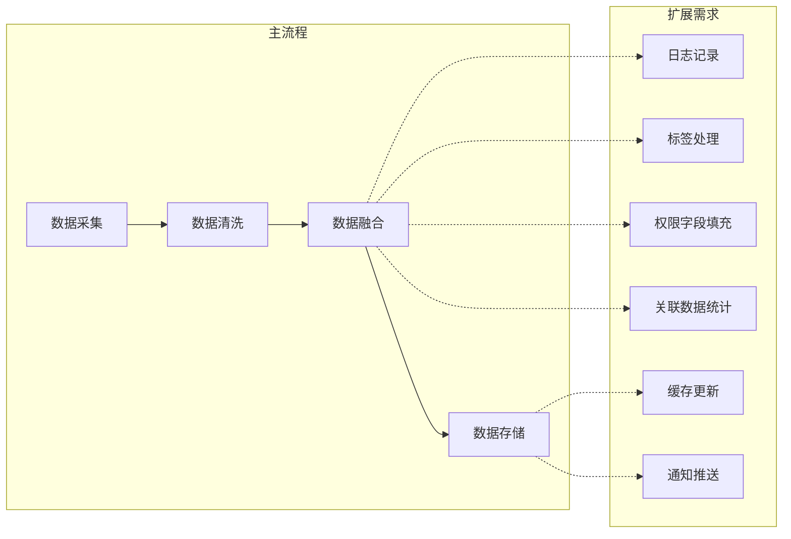

### 2.2 传统方案的问题

**硬编码方式**：

```pseudo
function processData(data):
    // 主流程
    cleanedData = clean(data)
    mergedData = merge(cleanedData)
    
    // 扩展逻辑（硬编码）
    logProcess(mergedData)           // 日志
    addTags(mergedData)              // 标签
    fillPermissionFields(mergedData) // 权限
    countRelations(mergedData)       // 统计
    
    save(mergedData)
    
    // 更多扩展...
    updateCache()
    sendNotification()
```

**问题**：
- **耦合度高**：主流程与扩展逻辑紧密耦合
- **扩展困难**：每次新增功能都需要修改主流程代码
- **维护成本高**：代码膨胀，难以理解和测试
- **灵活性差**：无法动态启用/禁用某些处理逻辑

### 2.3 事件驱动的优势

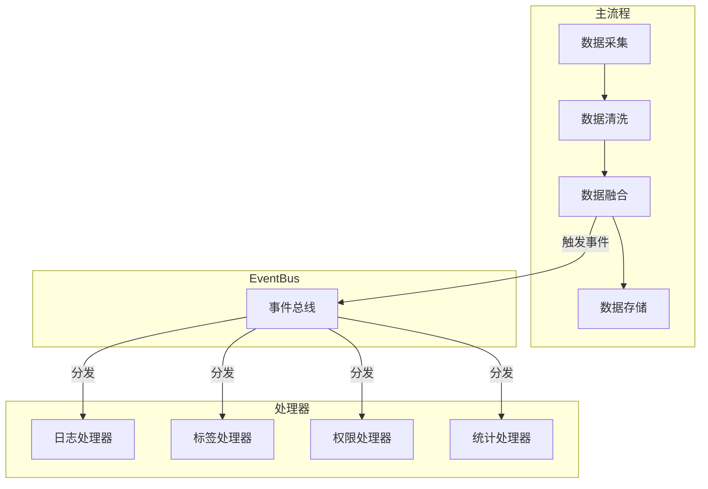

**优势**：
- **解耦**：主流程只负责触发事件，不关心具体处理逻辑
- **可扩展**：新增处理器无需修改主流程
- **可维护**：每个处理器职责单一，易于理解和测试
- **灵活**：可动态注册/注销处理器

---

## 三、事件机制初版设计

### 3.1 核心概念

事件机制的核心包含四个要素：

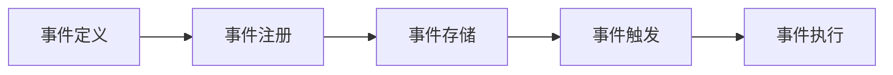

| 概念         | 说明                             |
| ------------ | -------------------------------- |
| **事件定义** | 定义事件类型和事件携带的数据结构 |
| **事件注册** | 将处理器绑定到特定事件           |
| **事件存储** | 维护事件与处理器的映射关系       |
| **事件触发** | 在业务流程中触发事件             |
| **事件执行** | 调用所有注册的处理器             |

### 3.2 事件定义

事件是系统中发生的有意义的动作或状态变化。良好的事件定义应该：

- 语义清晰，见名知意
- 粒度适中，不过细也不过粗
- 位置合适，便于扩展
- 携带足够的上下文信息

```pseudo
// 事件类型定义
const (
    // 任务生命周期事件
    EVENT_TASK_START = "task.start"
    EVENT_TASK_END   = "task.end"
    
    // 数据处理事件
    EVENT_DATA_MERGE     = "data.merge"
    EVENT_DATA_MERGE_END = "data.merge.end"
    
    // 批量操作事件
    EVENT_BATCH_BEFORE_WRITE = "batch.before_write"
)
```

**事件命名规范**：
- 使用 `领域.动作` 或 `领域.动作.阶段` 格式
- 使用小写字母和点号分隔
- 保持命名一致性

> 命名规范是团队内部确定，根据团队习惯来即可

### 3.3 事件注册

注册是将处理器与事件关联的过程：

```pseudo
// 处理器函数签名
type HandlerFunc = function(eventData: any) -> error

// 注册接口
interface EventBus:
    function registerHandler(event: string, handler: HandlerFunc, description: string) -> error
```

**初版注册方式**：

```pseudo
function init():
    eventBus = getEventBus()
    
    // 注册日志处理器
    eventBus.registerHandler(
        EVENT_TASK_START,
        logTaskStart,
        "任务开始-日志记录"
    )
    
    // 注册业务处理器
    eventBus.registerHandler(
        EVENT_DATA_MERGE,
        processBusinessLogic,
        "数据融合-业务处理"
    )
    
    // 注册标签处理器
    eventBus.registerHandler(
        EVENT_DATA_MERGE,
        addTags,
        "数据融合-标签处理"
    )
    
    // ... 更多处理器
```

### 3.4 事件存储

事件总线内部维护事件与处理器的映射：

```pseudo
class EventBus:
    // 存储结构：事件名 -> 处理器列表
    handlers: Map<string, List<Handler>>
    
    struct Handler:
        func: HandlerFunc
        description: string
    
    function registerHandler(event, handler, desc):
        if not handlers.has(event):
            handlers[event] = []
        handlers[event].append(Handler{func: handler, description: desc})
```

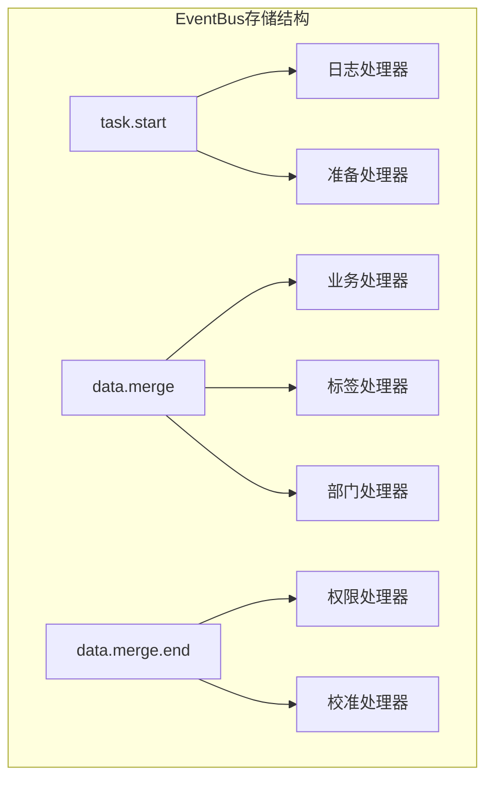

### 3.5 事件触发

在业务流程的关键节点触发事件：

```pseudo
function mergeDataFlow(taskId, dataList):
    // 触发任务开始事件
    eventBus.emit(EVENT_TASK_START, {taskId: taskId})
    
    for data in dataList:
        // 触发单条数据融合事件
        eventBus.emit(EVENT_DATA_MERGE, {taskId: taskId, data: data})
        
        // 执行融合逻辑
        mergedData = doMerge(data)
        
        // 触发单条数据融合结束事件
        eventBus.emit(EVENT_DATA_MERGE_END, {taskId: taskId, data: mergedData})
    
    // 触发批量写入前事件
    eventBus.emit(EVENT_BATCH_BEFORE_WRITE, {taskId: taskId, dataList: mergedDataList})
    
    // 写入数据
    batchWrite(mergedDataList)
    
    // 触发任务结束事件
    eventBus.emit(EVENT_TASK_END, {taskId: taskId})
```

### 3.6 事件执行

事件触发后，执行所有注册的处理器：

```pseudo
function emit(event, data):
    handlers = this.handlers[event]
    if handlers is empty:
        return
    
    // 并发执行所有处理器
    waitGroup = new WaitGroup()
    
    for handler in handlers:
        waitGroup.add(1)
        go function():
            defer waitGroup.done()
            try:
                handler.func(data)
            catch error:
                log.error("处理器执行失败: " + handler.description + ", error: " + error)
        ()
    
    waitGroup.wait()
```

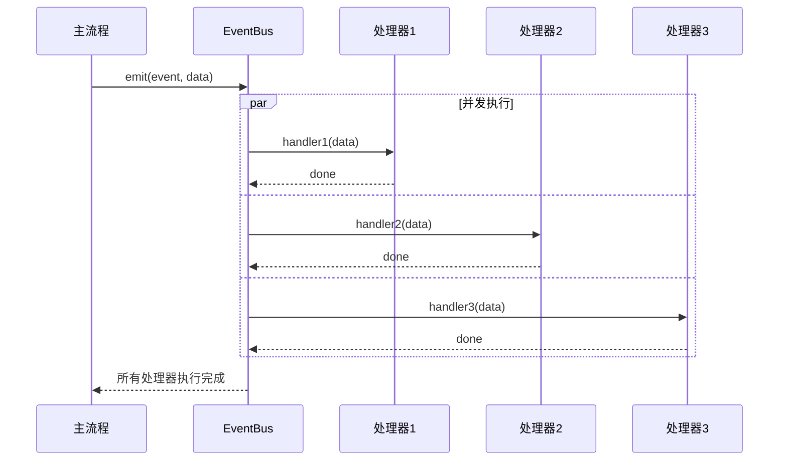

### 3.7 初版设计的问题

随着系统演进，初版设计暴露出一些问题：

| 问题             | 描述                                 |
| ---------------- | ------------------------------------ |
| **执行无序**     | 所有处理器并发执行，无法控制顺序     |
| **注册冗长**     | 大量处理器在一个函数中注册，难以维护 |
| **无超时控制**   | 处理器可能无限阻塞                   |
| **错误处理粗放** | 只记录日志，无法区分错误严重程度     |
| **重复计算**     | 多个处理器可能重复查询相同数据       |

---

## 四、事件机制升级优化

### 4.1 优先级与依赖链

#### 问题场景

某些处理器之间存在依赖关系：

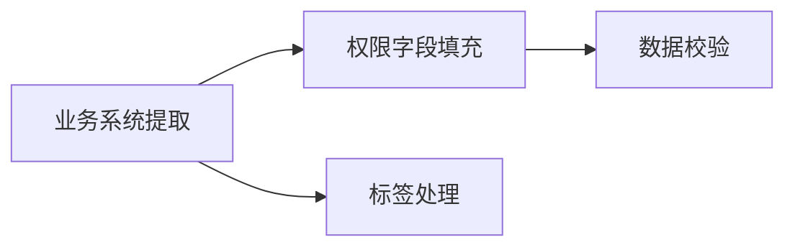

如果 **权限字段填充** 在 **业务系统提取** 之前执行，将无法获取正确的业务系统信息，因为权限字段依赖于业务系统信息。

#### 解决方案：引入优先级和分组

```pseudo
// 扩展处理器结构
struct Handler:
    func: HandlerFunc
    description: string
    priority: int
    group: string
```

所有分组按照顺序执行，组内按照优先级执行。这就能实现组内依赖链，组间并发执行。平衡依赖顺序和性能。


**执行顺序**：

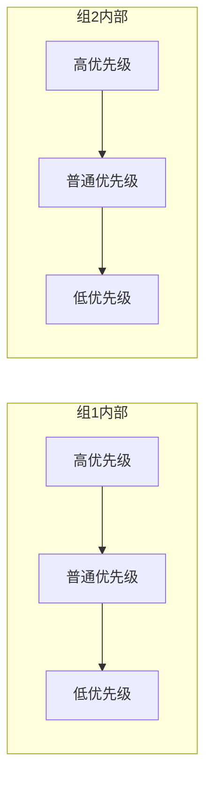

```pseudo
function emit(event, data):
    handlers = this.handlers[event]
    
    // 按分组和优先级排序
    sortedHandlers = sortByGroupAndPriority(handlers)
    
    // 分组顺序执行
    for group in allGroups:
        groupHandlers = filter(sortedHandlers, h => h.group == group)
        executeHandlerGroup(groupHandlers, data)
```

### 4.2 优雅注册

#### 问题场景

初版注册代码冗长，难以维护：

```pseudo
// 初版：所有注册在一个函数中
function init():
    // 60+ 个处理器注册...
    // 代码超过 500 行
```

随着业务发展，处理器数量不断增加，注册逻辑变得越来越复杂和难以维护。代码的可读性和可维护性都受到了影响。

#### 解决方案：声明式注册

```pseudo
// 按数据类型拆分注册
function registerAssetHandlers(eventBus):
    handlers = [
        {
            event: EVENT_TASK_START,
            handler: logTaskStart,
            description: "任务开始-日志记录",
            priority: LOW,
            group: LOGGING
        },
        {
            event: EVENT_TASK_START,
            handler: extractBusinessSystem,
            description: "任务开始-提取业务系统",
            priority: HIGH,
            group: PREPARATION
        },
        {
            event: EVENT_DATA_MERGE,
            handler: addTags,
            description: "数据融合-标签处理",
            priority: NORMAL,
            group: BUSINESS
        }
        // ...
    ]
    
    for h in handlers:
        eventBus.registerWithOptions(h.event, h.handler, {
            description: h.description,
            priority: h.priority,
            group: h.group
        })

// 主注册函数
function init():
    eventBus = getEventBus()
    
    registrars = [
        registerAssetHandlers,
        registerDeviceHandlers,
        registerDomainHandlers,
        registerVulnHandlers
    ]
    
    for registrar in registrars:
        registrar(eventBus)
```

**优势**：
- 代码结构清晰，按领域组织
- 配置集中，易于查看和修改
- 支持动态加载

### 4.3 执行控制

#### 4.3.1 超时控制

**问题**：处理器可能因网络、数据库等原因无限阻塞。

```pseudo
function executeWithTimeout(handler, data, timeout):
    resultChan = make(chan error, 1)
    
    go function():
        try:
            handler.func(data)
            resultChan <- nil
        catch error:
            resultChan <- error
    ()
    
    select:
        case err = <-resultChan:
            return err
        case <-time.after(timeout):
            return TimeoutError("处理器超时: " + handler.description)
```

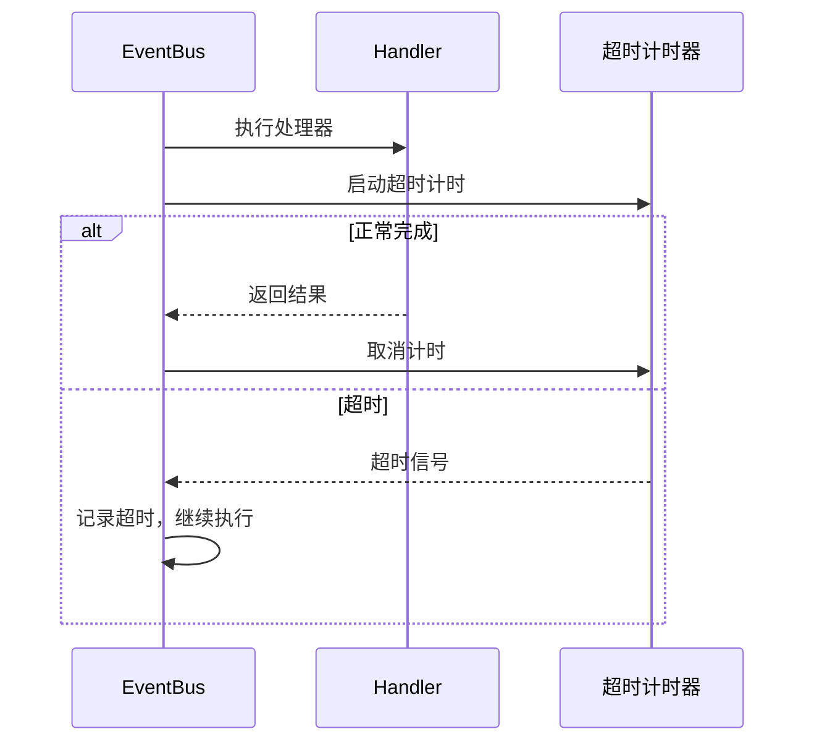

#### 4.3.2 异常范围收敛（熔断机制）

**问题**：某个处理器频繁失败会影响整体性能。

```pseudo
class CircuitBreaker:
    failureThreshold: int = 5      // 失败阈值
    resetTimeout: duration = 60s   // 重置超时
    failureCount: int = 0
    lastFailureTime: time
    state: enum {CLOSED, OPEN, HALF_OPEN}
    
    function call(fn):
        // 熔断器状态机：防止故障扩散
        // 当失败次数达到阈值时，进入OPEN状态，快速失败
        // 超过重置时间后进入HALF_OPEN状态尝试恢复
        // 在HALF_OPEN状态下只允许一次请求通过，验证服务是否恢复
        // 避免故障传播，保障系统稳定性
        // 通过这种方式，可以在服务短暂故障后自动恢复，避免长时间不可用
        if state == OPEN:
            if time.since(lastFailureTime) > resetTimeout:
                state = HALF_OPEN
            else:
                return CircuitOpenError()
        
        try:
            result = fn()
            onSuccess()
            return result
        catch error:
            onFailure()
            throw error
    
    function onSuccess():
        failureCount = 0
        state = CLOSED
    
    function onFailure():
        failureCount++
        lastFailureTime = time.now()
        if failureCount >= failureThreshold:
            state = OPEN
```

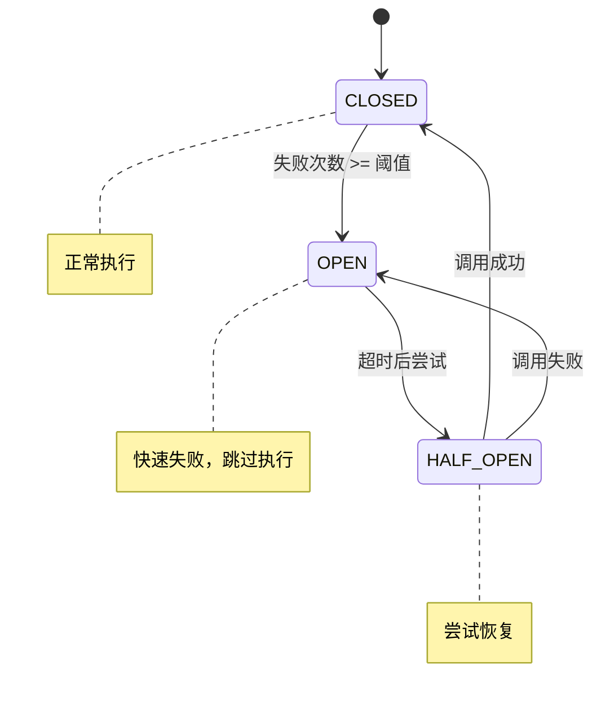

熔断器（Circuit Breaker）的三个状态是业界标准设计，源自 Martin Fowler 提出的熔断器模式：

| 状态              | 含义         | 行为                           |
| ----------------- | ------------ | ------------------------------ |
| CLOSED（关闭）    | 正常状态     | 正常执行请求，记录失败次数     |
| OPEN（打开）      | 熔断状态     | 快速失败，跳过执行，保护下游   |
| HALF_OPEN（半开） | 恢复探测状态 | 允许少量请求通过，测试是否恢复 |


#### 4.3.3 成功率监控

**问题**：缺少处理器级别的监控指标。

```pseudo
struct HandlerMetrics:
    handlerName: string
    executionCount: int64
    successCount: int64
    failureCount: int64
    totalDuration: duration
    maxDuration: duration
    minDuration: duration

class MetricsCollector:
    metrics: Map<string, HandlerMetrics>
    
    function record(handlerName, duration, error):
        m = metrics.getOrCreate(handlerName)
        m.executionCount++
        
        if error == nil:
            m.successCount++
        else:
            m.failureCount++
        
        m.totalDuration += duration
        m.maxDuration = max(m.maxDuration, duration)
        m.minDuration = min(m.minDuration, duration)
    
    function getSuccessRate(handlerName):
        m = metrics[handlerName]
        return m.successCount / m.executionCount * 100
```

**监控指标**：

| 指标     | 说明                 |
| -------- | -------------------- |
| 执行次数 | 处理器被调用的总次数 |
| 成功率   | 成功执行的比例       |
| 平均耗时 | 平均执行时间         |
| 最大耗时 | 最慢的一次执行时间   |
| 失败次数 | 执行失败的次数       |

### 4.4 数据共享

#### 问题场景

多个处理器可能需要相同的数据：

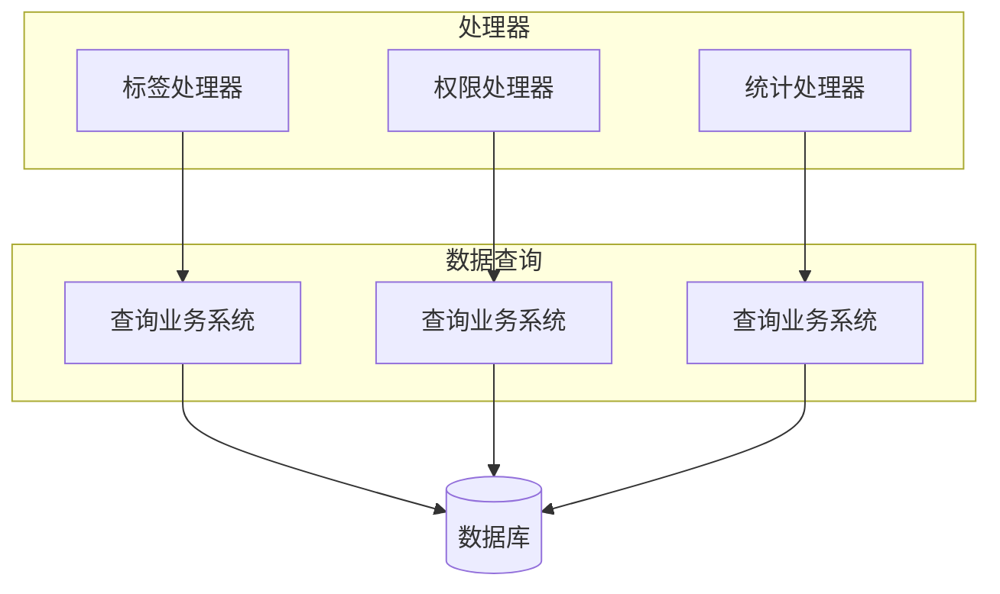

**问题**：重复查询，浪费资源。

#### 解决方案：事件上下文

```pseudo
struct EventContext:
    eventName: string
    traceId: string
    startTime: time
    cache: ConcurrentMap  // 线程安全的缓存

// 修改处理器签名
type HandlerFuncV2 = function(ctx: EventContext, data: any) -> error

// 处理器使用缓存
function tagHandler(ctx, data):
    cacheKey = "business_systems"
    
    // 尝试从缓存获取
    if cached = ctx.cache.get(cacheKey):
        businessList = cached
    else:
        // 查询并缓存
        businessList = queryBusinessSystems()
        ctx.cache.set(cacheKey, businessList)
    
    // 使用 businessList 处理标签
    applyTags(data, businessList)
```

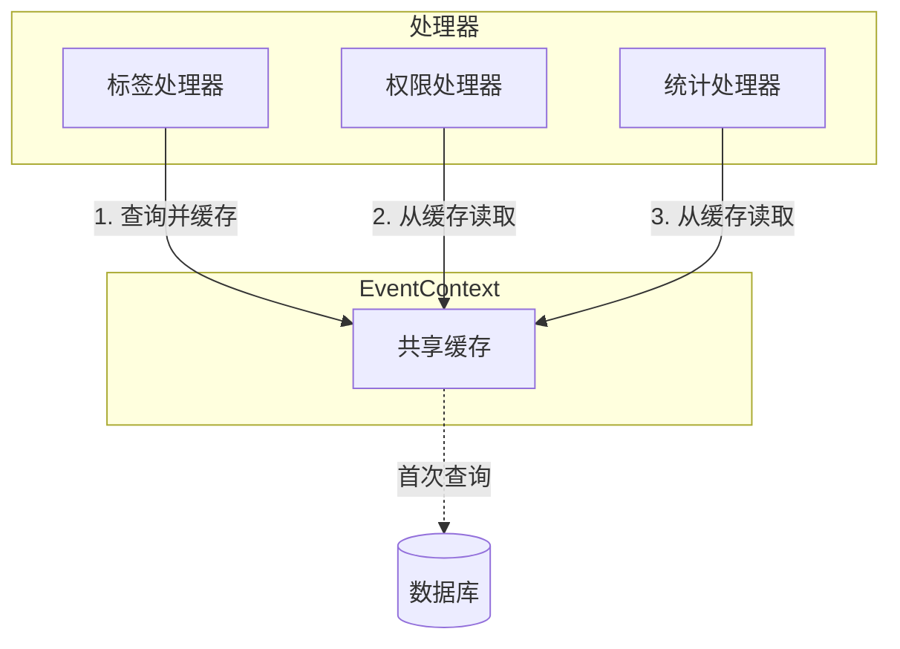

**优势**：
- 减少重复查询
- 降低数据库压力
- 提升整体性能

---

## 五、最佳实践与总结

### 5.1 事件设计原则

1. **单一职责**：每个事件只表示一个明确的动作或状态变化
2. **粒度适中**：不要过细（导致事件爆炸）也不要过粗（失去灵活性）
3. **位置合理**：事件应该在合适的业务节点触发，方便业务扩展
4. **携带足够上下文**：事件数据应包含处理器需要的所有信息
5. **命名规范**：使用统一的命名约定

### 5.2 处理器设计原则

1. **幂等性**：处理器应该是幂等的，重复执行不会产生副作用
2. **快速失败**：尽早发现错误，避免无效处理
3. **优雅降级**：非关键处理器失败不应影响主流程
4. **可观测**：记录关键指标，便于监控和排查

### 5.3 架构演进路线

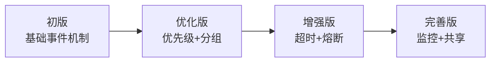

| 版本 | 特性         | 解决的问题             |
| ---- | ------------ | ---------------------- |
| V1   | 基础事件机制 | 解耦主流程与扩展逻辑   |
| V2   | 优先级+分组  | 控制执行顺序，支持依赖 |
| V3   | 超时+熔断    | 提升稳定性，防止阻塞   |
| V4   | 监控+共享    | 可观测性，性能优化     |

### 5.4 总结

事件驱动架构是处理复杂业务扩展的有效方案。通过合理的设计和持续优化，可以实现：

- **高内聚低耦合**：主流程与扩展逻辑分离
- **易扩展**：新增功能只需添加处理器
- **高可用**：超时、熔断机制保障稳定性
- **可观测**：完善的监控指标支持运维

关键是要根据实际业务场景，选择合适的优化策略，避免过度设计。

---

## 附录：完整架构图

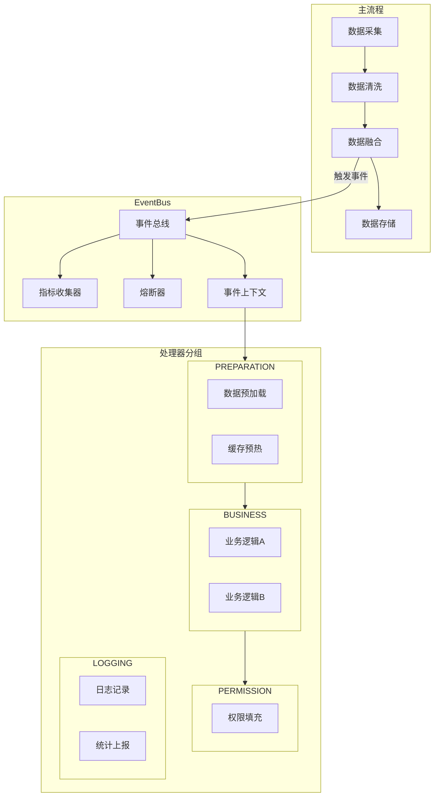
